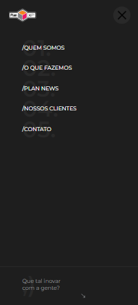

## Sobre o projeto
Aplicação feita em um desafio técnico no processo seletivo do Grupo Plan Marketing onde a tarefa era desenvolver o layout de um site da empresa.

<div align="center"> 
    Desktop
  
</div>
<div align="center"> 
    <p>Mobile</p>
  
  
</div>
<br/>

### Stacks
<details>
  <summary>Client</summary>
  <ul>
    <li><a href="https://pt-br.reactjs.org/">React.js</a></li>
    <li><a href="https://www.typescriptlang.org/">Typescript</a></li>
    <li><a href="https://styled-components.com/">Styled Components</a></li>
  </ul>
</details>

## Começando

### Pré-requisitos

Antes de começar, você precisará ter instalado em sua máquina as seguintes ferramentas: [Git](https://git-scm.com/), [Node.js](https://nodejs.org/en/) e [Typescript](https://www.typescriptlang.org/).
   
### Rodar localmanente

Clone o projeto

```bash
  git clone https://github.com/zirtaebn/grupo-plan-marketing-frontend.git
```

Vá para o diretório do projeto

```bash
  cd grupo-plan-marketing-frontend
```

Instale as dependências

```bash
  npm install
```

Inicie o servidor 

```bash
  npm start
```

## Contribuição

<a href="https://github.com/zirtaebn/weather-app--test/graphs/contributors">
  
</a>
</br>
Contribuições são sempre bem vindas!

## Contato

Beatriz Sant'Anna - [@zirtaebn](https://twitter.com/zirtaebn) - zirtaebndev@gmail.com

Link do projeto: [https://github.com/zirtaebn/grupo-plan-marketing-frontend](https://github.com/zirtaebn/grupo-plan-marketing-frontend)


## Reconhecimentos

Recursos e bibliotecas úteis que utilizei no projeto.
 - [Hamburguer React](https://www.npmjs.com/package/hamburger-react)
 - [React Icons](https://react-icons.github.io/react-icons/)
 